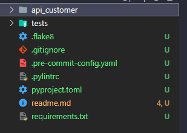
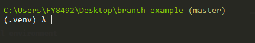

# steps

## 1. Setup the git repository

After you clone this repository, you must to configure it with your project repository

### Add repository

First get the URL of your project repository and define it as your origin

```bash
git remote set-url origin <url_your_project_repository>
```

Then, you can check if worked using the command:

```bash
git origin -v
```

you must be able to see you project repository URL

## 2. Setup the project name

  change the folder `my_project_name` to the name of your project.

  

## Create and activate the virtual environment

### Create the virtual environment

```bash
python -m venv .venv
```

### Activate the virtual environment

#### on WINDOWS

```bash
.venv\Scripts\Activate
```

#### on MAC or Linux

```bash
source .venv\bin\activate
```



## Install requirements

After the venv is created, you must install the basic requirements for python projects

```bash
pip install -r requirements.txt
```

## 3. Setup pre-commit

### Install plugin

```bash
pre-commit install --hook-type pre-commit --hook-type pre-push
```

### Update .yaml file

Open the *.pre-commit-config.yaml* file and replace **my_project_name** for the name of your project, the same that you replace the folder in the step 2

You are ready to go 😊
